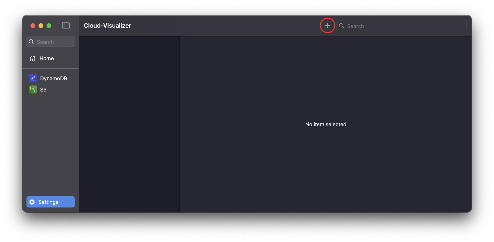
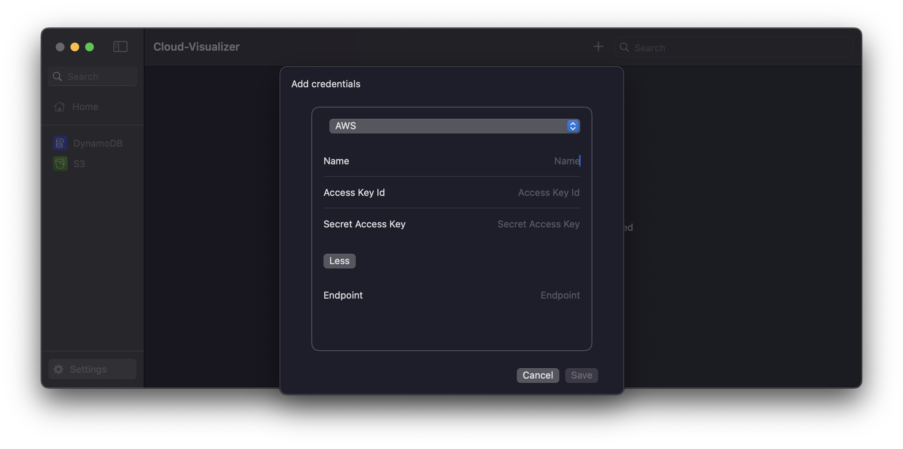

# Cloud Visualizer

Cloud Visualizer is a SwiftUI application that provides a unified interface to visualize cloud resources across multiple cloud providers (AWS, Google Cloud, Azure, etc.).

## Installation

First, download the latest [release](https://github.com/david-benistant/Cloud-Visualizer/releases).

Once you have installed the application, you need to set up your credentials. Navigate to **Settings**, then click on the **+** button in the top-right corner:



Next, select the provider you want to add and fill in the form with your credentials:



You can also edit the provider endpoint. This is useful if you are using local providers such as [LocalStack](https://www.localstack.cloud/).

## Roadmap

| Feature       | Provider        | Progress |
|--------------|----------------|:--------:|
| S3           | AWS            | ✅       |
| DynamoDB     | AWS            | 70%      |
| CloudWatch   | AWS            | ❌       |
| API Gateway  | AWS            | ❌       |
| Lambda       | AWS            | ❌       |
| EC2          | AWS            | ❌       |
| RDS          | AWS            | ❌       |
| SNS          | AWS            | ❌       |
| Firebase     | Google Cloud   | ❌       |
| Firestore    | Google Cloud   | ❌       |

Feel free to open an issue if you want to request a new feature or suggest a new provider.

## Contributing

Contributions are welcome! Feel free to open an issue or submit a pull request. Since this is my very first project in SwiftUI, I am open to any feedback or suggestions.

### Development

To run the project locally, you need to have Xcode installed. Then, fork the repository, clone it, and run the following commands:

```bash
cd Cloud-Visualizer
open Cloud-Visualizer.xcodeproj
```

You can then run the project by clicking the **Play** button in Xcode.

### Components

A set of reusable components is already implemented and can be found in the `Components` folder. To use a component, simply call it with the required parameters.

Documentation for each component should be available in the [Documentation](./Cloud-Visualizer/Documentation/) folder. If you add a new component, please provide documentation for it.

## License

This project is licensed under the MIT License. See the [LICENSE](LICENSE) file for details.

